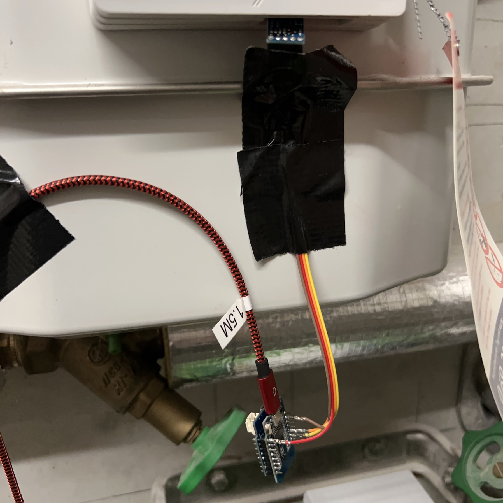

# Wemos_d1_gasmesser

This repository makes use of a QMC5883L Magnetic-Field Sensor rather then a reed-contact to detect changes in your gas consumption (Gasverbrauch).
Basicly inspired was this by this Rasperry-Pi Project.

I am using usualy PlatformIO but you can rename main.cpp to main.ino and this should work with #arduino as well.

[Gaszähler auslesen mit Magnetometer HMC5883 und Raspberry Pi](https://www.kompf.de/tech/gascountmag.html)

Required Material:
 - Wemos D1 Mini
 - QMC5883L Sensor - i did use this one Youmile GY-273 QMC5883L - Alternative you can use a HMC5883 - but you need then to use another library.
   Connect SCL -> D1 | SDA -> D2 | DRDY -> no connection
 
 Architecture:
  Gas counter --> Sensor --> Wemos D1 Wifi connections --> MQTT Server
  
Available values:
- Magnetic Field / Calculated as |b| = SQRT(X² + Y² + Z²)
- x-axis
- y-axis
- z-axis
- step-value / per default 0.01 when the treshold is reached otherwise 0.00
- mean_b / floating average of the last 4096 values
- min_b / minimum b value seen in the whole lifetime
- max_b / maximum b value seen in the whole lifetime
- diff_b / difference between the last send trigger value (low or high) and the actual trigger value.

Background
----------

The gas meter has a magnet on the wheel - which you can count when it reaches a position again. This results in a change of the magnetic field.
